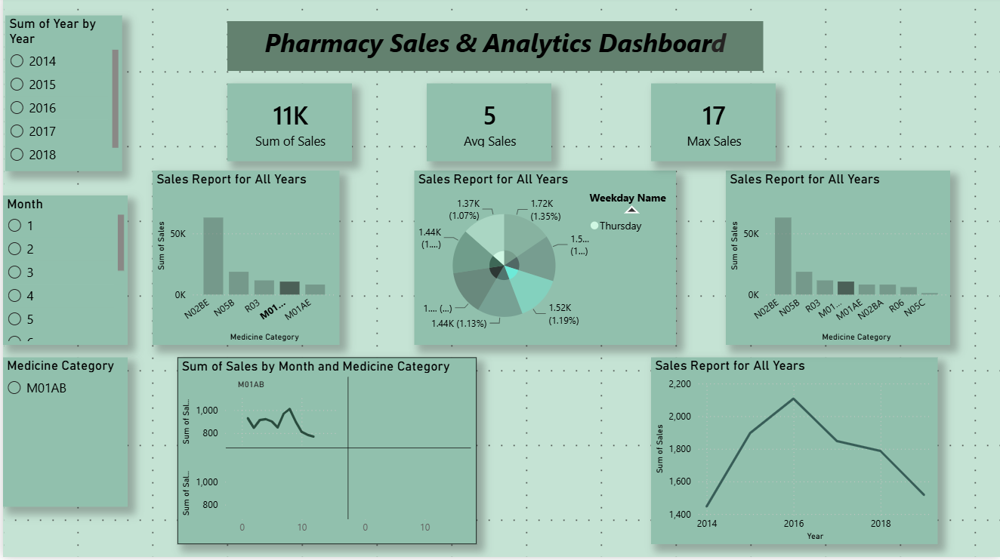

# 💊 Pharmacy Sales Analysis Dashboard

## 📊 Project Overview
This project showcases an interactive **Pharmacy Sales Analysis Dashboard** built using Power BI.

It helps in analyzing sales performance, tracking growth trends, and identifying top-performing products.

---

## 🚀 Features

- 📈 Sales Trend Analysis (Daily/Monthly)
- 📊 KPI Cards (Total Sales, Growth %)
- 💊 Top Selling Products
- 🔄 Trend Comparison (Current vs Previous Period)
- 🎯 Dynamic Filters (Date, Product)
- 🧠 Data-driven Insights

---

## 🗂️ Dataset

- File: `salesdaily.csv`
- Fields include:
  - Date  
  - Product Name  
  - Quantity  
  - Sales Amount  

---

## 🛠️ Tools Used

- Power BI  
- DAX  
- Excel  

---

## 📈 Key Metrics

- **Total Sales** = SUM(Sales Amount)

- **Growth %** =
  (Current Sales - Previous Sales) / Previous Sales

---

## 📷 Dashboard Preview

---

## 🧠 Insights

- Identified top-performing medicines  
- Analyzed monthly and daily sales trends  
- Compared current vs previous performance  
- Found peak sales periods  

---

## ⚙️ How to Use

1. Download the `.pbix` file  
2. Open in Power BI Desktop  
3. Load or refresh dataset  
4. Use filters to explore insights  

---

## 📁 Project Structure

Pharmacy-Sales-Analysis-Dashboard/
│── Pharmacy-Sales-Analysis-Dashboard.pbix
│── salesdaily.csv
│── Pharmacy_Sales_Analysis_Dashboard.png
│── README.md

## ⭐ Support

If you like this project, give it a ⭐ on GitHub!

---

## 🙌 Author

Aishwary Chavan# Pharmacy-Sales-Analysis-Dashboard
Power BI dashboard for pharmacy sales analysis with trend comparison and growth insights
